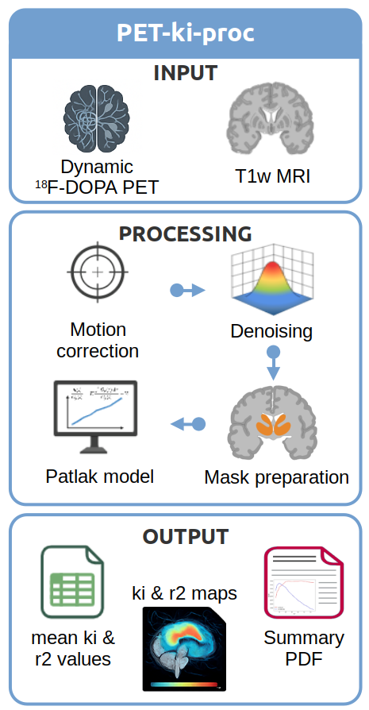
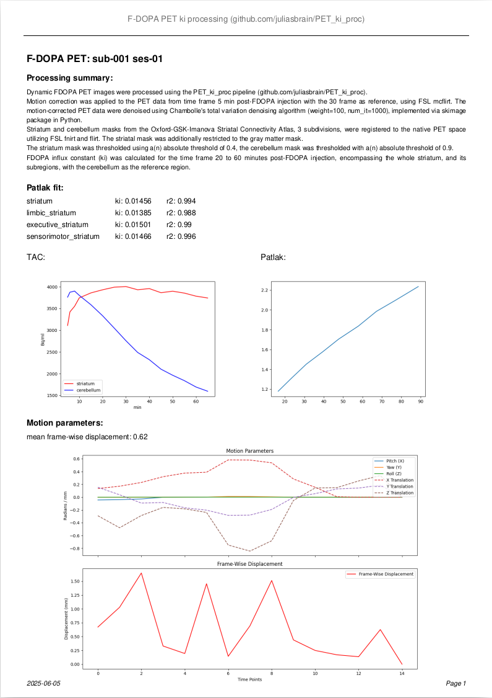
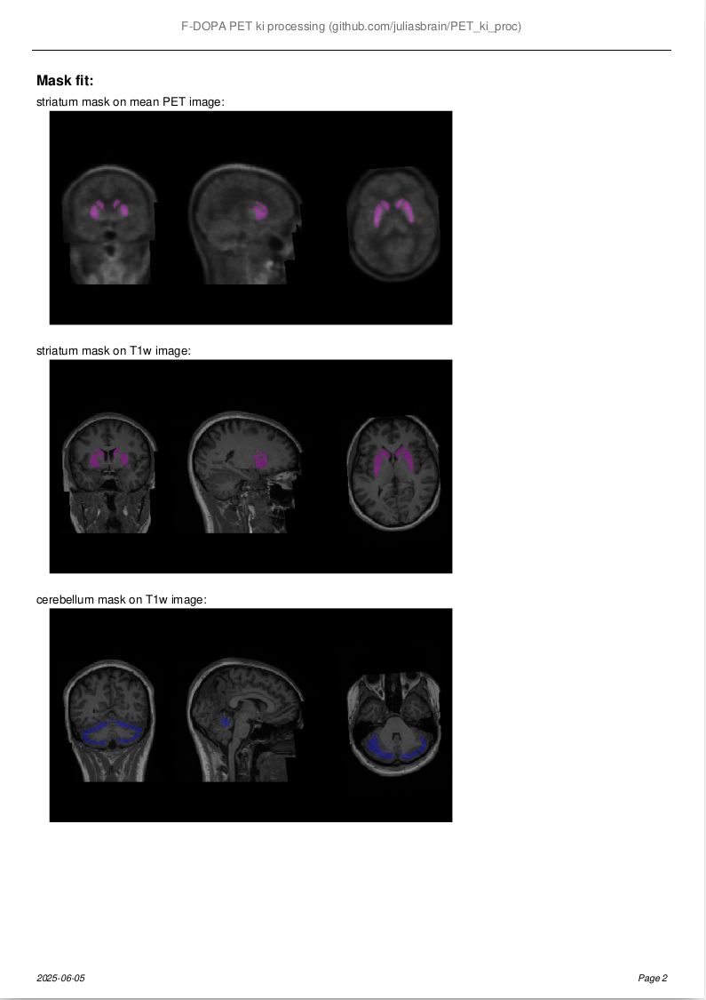

# 🧠 PET-ki-proc

**Automated processing pipeline for dynamic [18F]-DOPA PET and Ki estimation.**



<p><em>Figure:</em> Overview of PET-ki_proc pipeline. Some visual elements were created with <strong>BioRender.com</strong>; others are KI generated.</p>

---

## 🧾 Processing Overview

1. **Motion Correction**  
   - Correct PET data from 5 min post-injection using FSL `mcflirt`.

2. **Denoising (optional)**  
   - Apply Chambolle's total variation denoising (via `scikit-image`).

3. **Mask Preparation**  
   - Register T1w image to PET space (FSL `flirt`).
   - Normalize to MNI-152 (FSL `flirt` + `fnirt`).
   - Register striatum & cerebellum atlases to native space.
   - Optionally restrict striatum atlas to GM mask.
   - Apply absolute or percentile threshold & binarize.

4. **Patlak Fitting**  
   - Estimate Ki using Gjedde-Patlak linear modeling using cerebellum as reference.

---

## 💻 Usage

### Run for one subject:
```bash
run_PET_ki_proc.py -subject sub-001 -session 01 -denoising=True -gm_mask=True -ref_frame=30
```

### Run for all subjects in a session:
```bash
run_all.py 01 -denoising=True
```

---

## ⚙️ Arguments

| Argument          | Description |
|------------------|-------------|
| `-subject`        | Subject ID (e.g., `sub-001`) |
| `-session`        | Session ID (e.g., `01`) |
| `-subject_path`   | Path to BIDS dataset |
| `-ref_frame`      | Reference frame for motion correction (default: last-frame, e.g., `-ref_frame=30`) |
| `-denoising`      | Apply denoising (`True`/`False`, default: `True`) |
| `-gm_mask`        | Restrict striatum atlas to GM mask (`True`/`False`, default: `True`) |
| `-weight`         | Denoising weight (default: 100) |
| `-num_iter`       | Max number of iterations for denoising (default: 1000) |
| `-atlas`          | Atlas for masking (see below) |
| `-thr_striatum`   | Absolute threshold for striatum mask (e.g., `-thr_striatum=0.6`) |
| `-thrp_striatum`  | Percentile threshold for striatum mask (e.g., `-thrp_striatum=0.6`) |
| `-thr_cerebellum` | Absolute threshold for cerebellum mask (e.g., `-thr_cerebellum=0.9`) |
| `-thrp_cerebellum`| Percentile threshold for cerebellum mask (e.g., `-thrp_cerebellum=0.9`) |

---

## 📥 Input

- BIDS-formatted dataset  
- Decay-corrected dynamic PET image:  
  `sub-XXX/ses-YY/pet/sub-XXX_ses-YY_trc-18FDOPA_rec-acdyn_pet.nii`
- T1w anatomical image:  
  `sub-XXX/ses-YY/anat/sub-XXX_ses-YY_T1w.nii`


## 📤 Output 

in `sub-XXX/ses-YY/pet/patlak_fit/`

- `Ki` map: `patlak/*_ki_map_thr0.4.nii.gz`
- `R²` map: `*patlak/_r2_map_thr0.4.nii.gz`
- Results sheet: `*_OGI_3_thr0.6_denoised_PET_ki.xlsx`
- Summary PDF: `*_OGI_3_thr0.6_denoised_PET_ki.pdf`

---

## 🗺 Available Atlases

- `OGI_3`: Oxford-GSK-Imanova (3 subregions)
- `OGI_7`: Oxford-GSK-Imanova (7 subregions)
- `HO`: Harvard-Oxford subcortical atlas
- `CIT`: CIT168 subcortical atlas
-  add your own atlas to `pwt_ki_proc/app/data/atlas`

---

## Installation

## Option 1: 🐳 Docker 

Run with Docker (recommended for easiest setup).

### Pull the image:
```bash
docker pull juliasbrain/pet_ki_proc
```

### Run docker:
```bash
docker run --rm -it -v /path/to/preprocData:/app/preprocData juliasbrain/pet_ki_proc run_PET_ki_proc.py -subject sub-001 -session 01 -denoising=True
docker run --rm -it -v /path/to/preprocData:/app/preprocData juliasbrain/pet_ki_proc run_all.py 01 -denoising=True
```

## Option 2: 🐍 Python package

Install Python package via pip (requires FSL installed on your machine).

### Install:
```bash
pip install git+https://github.com/juliasbrain/PET_ki_proc.git
```

### Run:
```bash
run_PET_ki_proc -subject sub-001 -session 01 -denoising=True -subject_path /path/to/preprocData

run_all 01 -denoising=True -subject_path /path/to/preprocData
```

---

## 📚 Summary pdf
   

---

## 📎 Citation
Please cite this repo when using the application. <https://github.com/juliasbrain/PET_ki_proc>